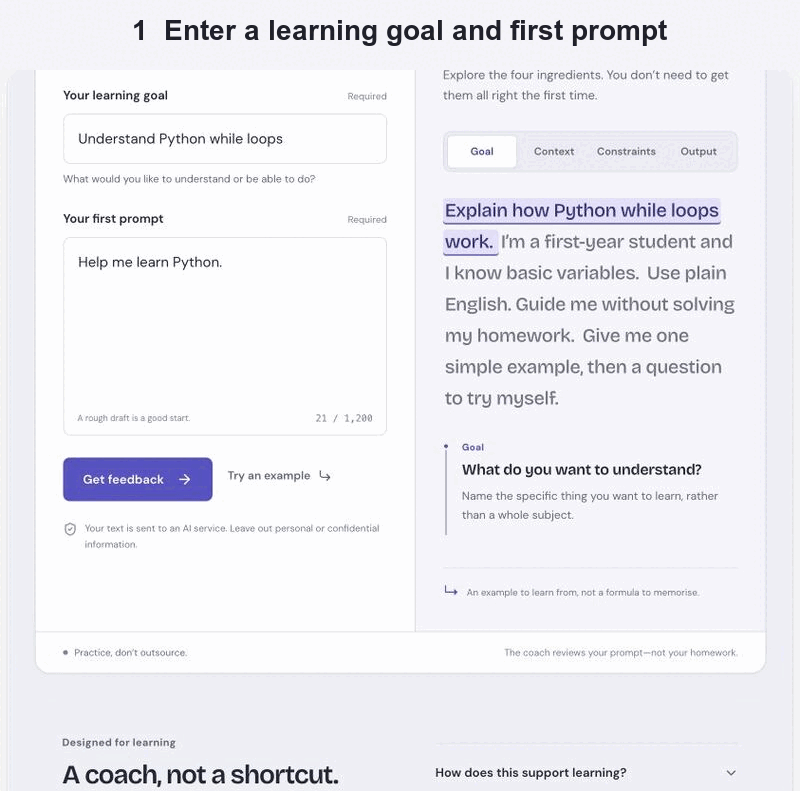

# Prompt Coach demo

This demo records the complete example flow in the connected Lovable preview on 10 September 2026:

1. The learner enters “Understand Python while loops” and the draft “Help me learn Python.”
2. The live Lovable AI service evaluates Goal, Context, Constraints and Output and returns feedback about the submitted wording.
3. The learner revises the prompt. The live service compares both versions and returns specific improvements plus one next step.

The three JPEG files are the source evidence for each stage. They show the working product, not wireframes or a static design mock-up. The product source and server-side Lovable AI integration are in [`../prompt-coach/`](../prompt-coach/).
