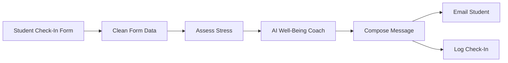

# AI Study Stress Coach

AI Study Stress Coach is an automated n8n workflow that helps students pause, assess study pressure, and receive short, personalised well-being guidance by email. It is designed for university and applied-science students who feel stressed by workload, poor sleep, and approaching deadlines.

> This is a general well-being support tool, not a therapist, diagnostic system, crisis service, or replacement for professional help.

## Submission assets

- [Importable n8n workflow](workflow/ai-study-stress-coach.json)
- [Corrected demo video](demo/ai-study-stress-coach-demo.mp4)
- [Presentation deck](presentation/ai-study-stress-coach-deck.pdf)

The repository contains no API keys, OAuth tokens, or live student data. Credential references, deployment identifiers, and the private Google Sheet URL were removed from the public workflow export.

## What it does

1. A student submits a short n8n form with their stress level, sleep, workload, deadlines, and a brief description of how they feel.
2. The workflow cleans the form data and calculates a transparent project stress score.
3. It assigns a Low, Moderate, or High category and flags very high stress or signs of serious overwhelm.
4. An OpenAI node produces fewer than 150 words of warm, practical guidance under strict safety instructions.
5. n8n formats and emails a visual stress snapshot to the student.
6. The check-in and response are appended to a restricted Google Sheet for review.



## Hackathon requirements

| Requirement | Implementation |
| --- | --- |
| Built in n8n with at least 6 connected nodes | 7 connected nodes |
| Includes an AI node | OpenAI generates context-specific guidance |
| Runs automatically | An n8n Form Trigger starts the workflow on every submission |
| Addresses SDG 3 and mental health | Supports student stress awareness and well-being while directing serious concerns to people |

## SDG 3: Good Health and Well-being

The project supports [UN Sustainable Development Goal 3](https://sdgs.un.org/goals/goal3), including mental health and well-being. Study pressure, inadequate sleep, and heavy workloads can make it harder for students to organise work or ask for help. This workflow lowers the friction of taking a first step: it combines a short check-in, a transparent rule-based category, personalised wording, email delivery, and a logged result.

It does not claim to diagnose, treat, or prevent a mental-health condition.

## Scoring logic

The project score is:

```text
stress + (0.6 x workload) + (0.5 x deadlines) + sleep adjustment
```

- Less than 4 hours of sleep adds 3 points.
- From 4 to less than 6 hours adds 1.5 points.
- A score below 8 is Low, 8 to below 14 is Moderate, and 14 or more is High.
- A High category, a self-reported stress level of 9 or 10, or selected distress language activates the support suggestion.

This score is a project rule for routing support. It is not a validated clinical scale or a diagnosis.

## How to run it

You need an n8n instance and credentials for OpenAI, Gmail, and Google Sheets.

1. Download [the workflow JSON](workflow/ai-study-stress-coach.json).
2. In n8n, choose **Import from File** and select the JSON.
3. Open **AI Well-Being Coach** and connect an OpenAI credential. Confirm that the selected model is available to your account.
4. Open **Email Student** and connect the Gmail account that should send the guidance.
5. Create a restricted Google Sheet with these headers: `Timestamp`, `Name`, `Email`, `Stress Level`, `Sleep Hours`, `Workload`, `Deadlines`, `Feeling`, `Stress Category`, `Stress Score`, and `AI Response`.
6. Open **Log Check-In**, connect Google Sheets, select the new document and sheet, and confirm the column mapping.
7. Test the workflow with fictional data and an authorised test inbox. Do not enter real sensitive information during setup.
8. Publish the form and activate the workflow. After activation, each form submission triggers the complete flow automatically; no manual run is needed.

The exported workflow is intentionally inactive so importing it cannot send email or write data before the reviewer configures their own credentials.

## Ethical reflection

I would not trust this automation to make health decisions for me. Its score is a simple project rule, and the AI can misunderstand context or give advice that is generic, unsuitable, late, or unavailable. A student might also mistake a High label for a diagnosis, while a failed email could create false reassurance because the form confirms submission before delivery finishes. Automation should stop at low-risk check-in, general study and self-care suggestions, and signposting. A trusted person, study counsellor, or healthcare professional should take over whenever someone feels unable to cope, may be at risk, needs a diagnosis or treatment, or asks for human help. In real use, execution failures should be monitored, support options should appear directly on the confirmation page, access to the Sheet should be restricted, and identifiable check-ins should have a defined deletion period.

## Privacy and safety notes

- The form collects names, email addresses, and well-being responses; these are sensitive personal data.
- Use data minimisation, informed consent, restricted access, retention limits, and deletion procedures before any real deployment.
- Do not place crisis detection or emergency response responsibility on this workflow.
- Review the AI instructions and test cases regularly for bias, unsafe wording, and false reassurance.
- Monitor n8n executions so email or logging failures are visible to the operator.

## Demo

The [demo video](demo/ai-study-stress-coach-demo.mp4) shows the real form and automated support flow. The [presentation deck](presentation/ai-study-stress-coach-deck.pdf) explains the problem, workflow, scoring rule, SDG 3 connection, and ethical safeguards. All demonstration inputs are fictional.

