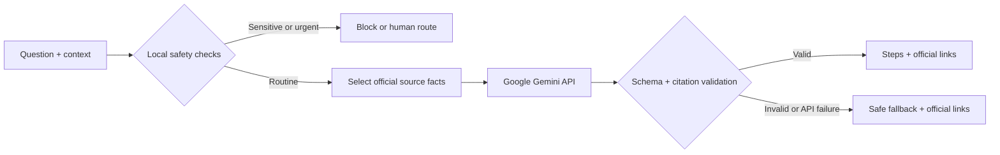

# MigrationHelp — Hackathon 3: Equal Access

MigrationHelp is a Python/Streamlit chatbot that helps recently arrived adults in the Netherlands with limited Dutch understand their **first administrative steps**. A user can ask about municipal registration, a BSN, DigiD, health insurance, or where to continue a residence-permit question. A live Google Gemini API call turns a curated pack of official Dutch sources into a short route in one of six languages.

> **Boundary:** MigrationHelp gives general public information. It does not decide eligibility, provide legal or medical advice, handle asylum cases, or replace the municipality, IND, an insurer, or a qualified adviser.

## Submission assets

- [Working Python application](migrationhelp/)
- [Simple explanation of the Python and API call](HOW_THE_CODE_WORKS.md)
- [Demo and recording script](demo/DEMO_SCRIPT.md)
- [Recorded working demo (MP4)](demo/MigrationHelp-demo.mp4)
- [Live Gemini verification record](demo/LIVE_TEST_RESULT.md)
- [Ethical reflection](ETHICAL_REFLECTION.md)
- [Rubric evidence map](RUBRIC_EVIDENCE.md)
- [Team presentation](presentation/MigrationHelp-Hackathon-3-final.pptx)
- [Final submission checklist](SUBMISSION_CHECKLIST.md)

## The specific inequality

Newcomers must navigate several Dutch organisations soon after arrival, but language and system knowledge are not distributed equally.

- On 1 January 2025, slightly over **3 million people in the Netherlands (16.8% of residents) were born abroad** ([Statistics Netherlands, 2026](https://www.cbs.nl/en-gb/dossier/asylum-migration-and-integration/how-many-residents-of-the-netherlands-have-a-non-dutch-background-)).
- In Statistics Netherlands' 2021 Labour Force Survey, **10.2% of migrants said they spoke little or no Dutch**, and more than half said that they spoke little or no Dutch when they first migrated ([CBS, 2023](https://www.cbs.nl/en-gb/news/2023/44/good-command-of-dutch-enhances-labour-participation)).
- The Dutch National Ombudsman states that foreign nationals do not always speak Dutch and therefore find it harder to find the right route through government ([National Ombudsman, dossier on foreign nationals](https://www.nationaleombudsman.nl/vreemdelingen)). The Ombudsman also reports that multiple agencies, digital systems, laws and rules make services difficult to access ([National Ombudsman, access to services](https://www.nationaleombudsman.nl/professionals/ombudsagenda/ombudsagenda-2025/toegang-tot-voorzieningen)).

The inequality is therefore not simply “migration is difficult.” It is an **administrative information gap**: a newly arrived adult with limited Dutch has less ability to find, understand and sequence essential public-service information than a Dutch-speaking resident who already knows the system. Missing a registration step can delay access to a BSN, online public services, work or care.

This supports [SDG 10: Reduced Inequalities](https://sdgs.un.org/goals/goal10), especially equal access to social and administrative participation.

## Intended users — and who is left out

### For

MigrationHelp is for an adult who:

- recently moved to the Netherlands for work, study or family;
- needs a first route through routine national administration;
- has limited Dutch but can use a simple web form;
- wants an answer in English, Dutch, Arabic, Turkish, Polish or Ukrainian; and
- will verify important details with the linked official authority.

The app is designed for use on a phone, uses short instructions, keeps official links visible, and does not require an account.

### Not for

It is not intended for asylum decisions, undocumented migration advice, appeals or court deadlines, minors using the service alone, emergencies, medical diagnosis, or someone who cannot safely access a web device. Those users need a qualified human, an interpreter, legal aid, emergency services, or the responsible authority. The current prototype also covers only the Netherlands and only five routine topics.

## What the user provides and receives

1. The user chooses an answer language and approximate length of stay, optionally adds a city, and writes one question.
2. Python checks for empty/oversized input, possible BSN or document details, and urgent danger language.
3. A deterministic keyword router selects up to four relevant pages from a reviewed pack of Government.nl and IND sources.
4. Python sends only the question, limited context, and selected verified facts directly to the Google Gemini API. The app does not write the conversation to disk or maintain chat history.
5. The LLM returns a strict JSON object: direct answer, up to four steps, items to prepare, limitations, risk level, and source IDs.
6. Python validates that the cited IDs came from the supplied source pack. If the response is malformed or uncited, the app rejects it.
7. The interface shows the plain-language route and clickable official sources. The user remains responsible for confirming critical details.



The API is necessary: keyword routing finds relevant evidence, but the LLM performs the non-trivial step of translating and adapting several official facts into a short, situation-specific route. Without the LLM, this prototype would only be a link directory.

For a short, presentation-ready explanation of the code, see [How the Python and Gemini API call work](HOW_THE_CODE_WORKS.md).

## Run locally

Requires Python 3.10+ and a Google Gemini API key. Never commit the key. The implementation follows Google's [structured-output guidance for the Gemini Python SDK](https://ai.google.dev/gemini-api/docs/generate-content/structured-output).

```bash
cd "Term 1/Week 3/hackathon/migrationhelp"
python3 -m venv .venv
source .venv/bin/activate
python -m pip install -r requirements.txt
cp .env.example .env
```

Open `.env` locally and enter your key after `GEMINI_API_KEY=`. Then run:

```bash
streamlit run app.py
```

Open the local address printed by Streamlit (normally `http://localhost:8501`). The app shows **Live AI is connected** when the key is loaded. `GEMINI_MODEL` defaults to `gemini-3.5-flash-lite`; a temporary server failure automatically tries `GEMINI_FALLBACK_MODEL`, which defaults to `gemini-3.8-flash`.

The assignment requirement explicitly names **Gemini**, and this project calls Google's Gemini API directly through the official `google-genai` Python SDK. No third-party model gateway is used.

## Tests

The automated tests do not call the API or spend credits:

```bash
cd "Term 1/Week 3/hackathon/migrationhelp"
python -m pytest -q
```

They cover topic routing, empty input, likely BSN blocking, emergency detection, rejection of invented source IDs, acceptance of a valid structured answer, the Gemini request configuration, and temporary server-error fallback. The live cases and results are recorded in [the verification record](demo/LIVE_TEST_RESULT.md).

## What happens when the AI gives a bad answer?

- **Invented citation:** rejected because source IDs must match the exact source pack sent to the model.
- **Malformed or incomplete output:** rejected by strict JSON schema and a second Python validation layer.
- **No answer, timeout, connection error, invalid key or rate limit:** a clear error is shown, followed by relevant official links; the app does not invent a replacement answer.
- **Unsupported or case-specific question:** the prompt requires an explicit limit and referral to the responsible human organisation.
- **Sensitive input:** a likely BSN or named identity-number field is stopped before an API call.
- **Urgent danger:** handled deterministically with 112 guidance before an API call.
- **Out-of-date source:** every displayed source has a review date; maintainers must recheck the source pack. The user is told to verify critical details.

These controls reduce risk but cannot guarantee factual correctness or equal translation quality.

## Official information pack

The app uses only these pages, reviewed on 23 September 2026:

- [Moving to the Netherlands — Government.nl](https://www.government.nl/faq/what-do-i-need-to-arrange-if-im-moving-to-the-netherlands)
- [Registering in the BRP — Government.nl](https://www.government.nl/faq/when-should-i-register-with-the-personal-records-database-as-a-resident)
- [Applying for a DigiD — Government.nl](https://www.government.nl/themes/government-and-democracy/online-access-to-public-services-european-economic-area-eidas/digid/digid-applications-from-the-netherlands)
- [Health insurance after moving — Government.nl](https://www.government.nl/faq/health-insurance/when-do-i-need-to-take-out-health-insurance-if-i-come-to-live-in-the-netherlands)
- [Living with a residence permit — IND](https://ind.nl/en/living-in-the-netherlands-with-a-residence-permit/living-in-the-netherlands)
- [IND service navigation](https://ind.nl/en)

This is a curated prototype, not live retrieval. That makes evidence auditable but creates a maintenance obligation.

## Team contributions

- **Maximilian Lopez:** Python and Streamlit implementation, Gemini API integration, validation and safety controls, testing, demo, documentation and presentation preparation.
- **Quinten van Ingen:** Project concept and initial idea.
- **AI use:** OpenAI Codex helped draft, test and document the prototype and prepare the presentation. The team reviewed the working app and must be able to explain every design decision.

## Ethical reflection

The full reflection is in [ETHICAL_REFLECTION.md](ETHICAL_REFLECTION.md). The biggest risk is **authoritative-sounding wrong guidance to a person who has less ability to verify it**. A wrong deadline or incorrect route can cost time, money, access to care, or residence security. MigrationHelp limits this by using a small reviewed official source pack, requiring valid source IDs, refusing case-specific decisions, keeping the original links visible, blocking likely identity details, and failing closed when output cannot be verified. These measures reduce harm; they do not make the chatbot an authority. A real deployment would require migrant user testing, professional review, scheduled source revalidation, better accessibility, independent translation evaluation, and a maintained human-referral network.

## Known limitations and next steps

- The source pack can become outdated and must be rechecked on a schedule.
- Translation quality may differ by language; no multilingual user evaluation has yet been completed.
- Keyword retrieval covers only a small vocabulary and five topics.
- The input filter can miss sensitive data or block an innocent nine-digit number.
- The prototype has no municipality-specific source data.
- A real service needs consent language, a privacy impact assessment, usage monitoring without storing message content, professional review and tests with intended users.
